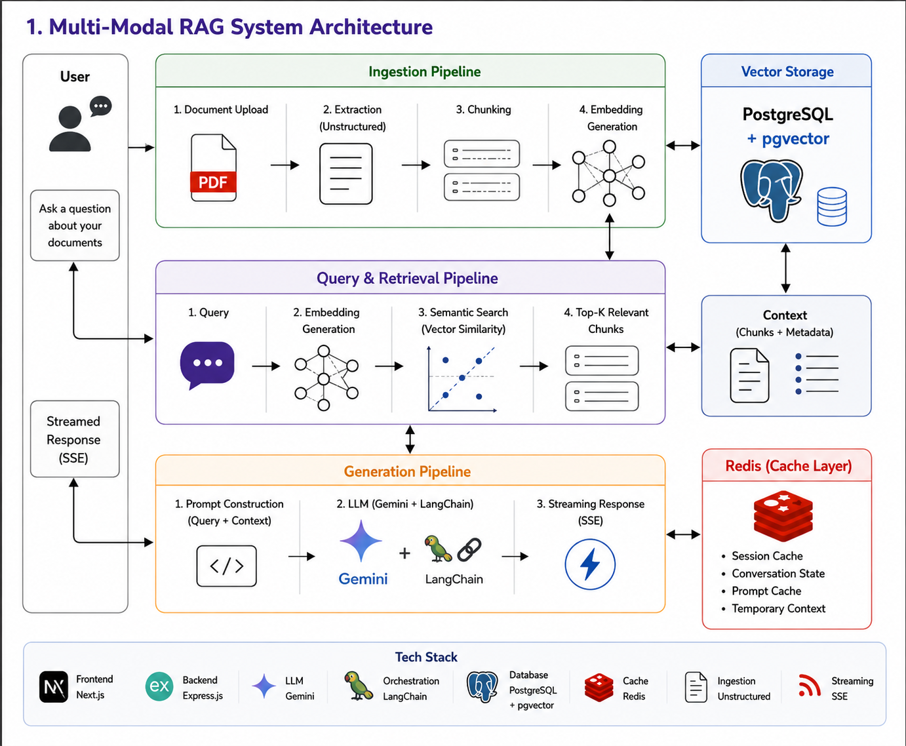
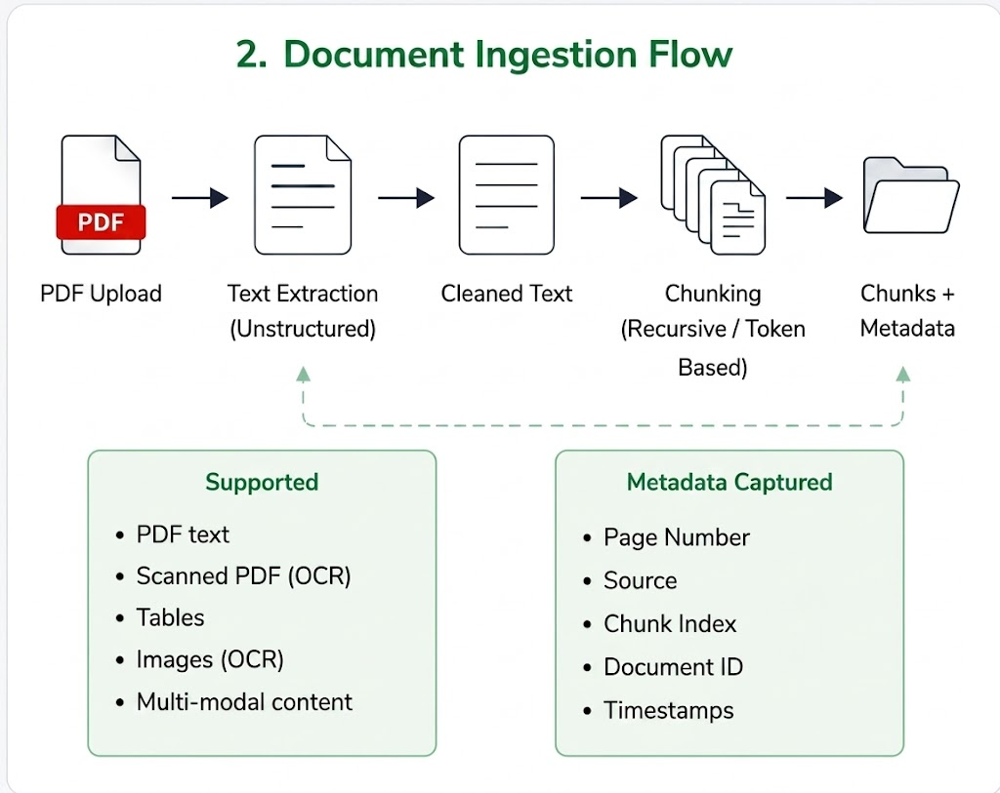
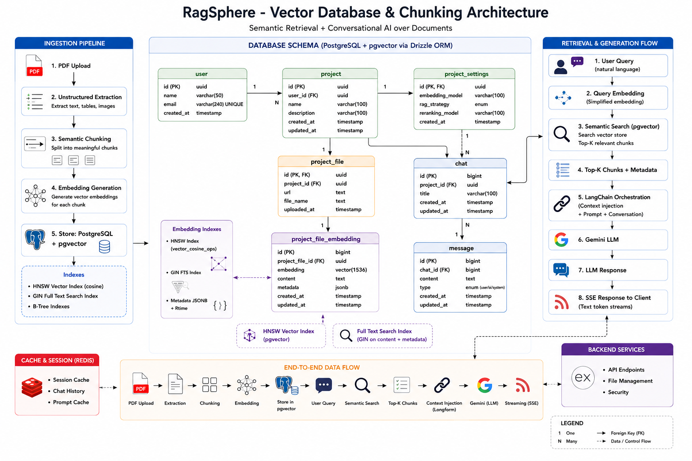

# RagSphere

> Semantic Retrieval + Conversational AI over Documents using LangChain, PostgreSQL pgvector, Redis, SSE streaming, and modern retrieval pipelines.

RagSphere is a multi-modal Retrieval-Augmented Generation (RAG) platform that enables users to upload documents and interact with them through context-aware AI conversations.

The system is designed around:

- semantic retrieval
- vector embeddings
- contextual conversations
- real-time streaming
- scalable retrieval pipelines

Built using:

- Next.js
- Express.js
- LangChain
- PostgreSQL + pgvector
- Redis
- Drizzle ORM
- Gemini AI

---

# Live Platform

## Frontend

https://multi-modal-rag-gamma.vercel.app/

---

# API Documentation

## Express.js API Docs

https://dakshpurohit.tech/api

---

# Images

## System Architecture



## Document Ingestion Flow



## Vector Database & Chunking Architecture



---

# Repository

## GitHub Repository

https://github.com/EzioAuditore12/Multi-Modal-RAG

---

# Core Features

- PDF upload and semantic processing
- Multi-modal ingestion pipeline
- Context-aware AI conversations
- Semantic retrieval using pgvector
- Real-time AI response streaming with SSE
- Redis-based conversational session caching
- Chunking-based retrieval pipeline
- Vector similarity search
- Metadata-aware retrieval
- Conversational memory management

---

# Retrieval Pipeline

The platform follows a Retrieval-Augmented Generation workflow:

```text
PDF Upload
   ↓
Unstructured Extraction
   ↓
Semantic Chunking
   ↓
Embedding Generation
   ↓
PostgreSQL + pgvector
   ↓
Semantic Retrieval
   ↓
LangChain Context Injection
   ↓
Gemini AI Generation
   ↓
Streaming Response (SSE)
```

---

# Tech Stack

## Frontend

- Next.js 16
- React 19
- TypeScript
- Tailwind CSS
- TanStack Query
- TanStack Form
- Zustand
- Motion
- ShadCN/UI
- Extended EventSource (SSE)
- Zod

---

## Backend

- Express.js
- TypeScript
- Socket.IO
- LangChain
- LangGraph
- Drizzle ORM
- PostgreSQL
- pgvector
- Redis
- Cloudinary
- Multer
- Pino Logger
- Better SSE
- Zod

---

## AI & Retrieval

- Gemini AI
- LangChain
- LangGraph
- Unstructured
- Semantic Chunking
- Vector Similarity Search
- Context Injection Pipelines

---

# Architecture Overview

## Ingestion Pipeline

Uploaded PDFs are processed through:

- text extraction
- metadata parsing
- semantic chunking
- embedding generation

The ingestion system supports:

- scanned PDFs
- OCR-ready documents
- tables
- multi-modal content

---

## Vector Storage

Document embeddings are stored inside:

- PostgreSQL
- pgvector

The retrieval layer uses:

- cosine similarity search
- HNSW indexing
- metadata filtering
- semantic ranking

---

## Redis Cache Layer

Redis is used for:

- conversational memory
- session caching
- prompt caching
- temporary retrieval context

This improves:

- retrieval speed
- AI continuity
- response latency

---

## Real-Time Streaming

Responses are streamed using:

- Server-Sent Events (SSE)

This enables:

- token streaming
- low-latency responses
- live AI generation

---

# Project Structure

```text
MULTI-MODAL-RAG/
│
├── frontend/
│
├── backend/
│
├── docs/
│   └── images/
│       ├── system-architecture.png
│       ├── document-ingestion-flow.png
│       └── vector-database-chunking.png
│
└── README.md
```

---

# Installation

## Clone Repository

```bash
git clone https://github.com/EzioAuditore12/Multi-Modal-RAG
cd Multi-Modal-RAG
```

---

# Frontend Setup

## Navigate to frontend

```bash
cd frontend
```

## Install dependencies

```bash
pnpm install
```

## Start development server

```bash
pnpm dev
```

Frontend runs on:

```text
http://localhost:3000
```

---

# Backend Setup

## Navigate to backend

```bash
cd backend
```

## Install dependencies

```bash
pnpm install
```

## Setup environment variables

Create a `.env` file:

```env
DATABASE_URL=
REDIS_URL=
GOOGLE_API_KEY=
CLOUDINARY_URL=
```

## Run database migrations

```bash
pnpm db:push
```

## Start development server

```bash
pnpm start:dev
```

Backend runs on:

```text
http://localhost:8000
```

---

# Database Features

- PostgreSQL relational storage
- pgvector embedding support
- semantic vector search
- metadata filtering
- chunk indexing
- retrieval optimization

---

# AI Features

- Conversational Retrieval-Augmented Generation
- Context Injection
- Semantic Search
- Conversational Memory
- Streaming AI Responses
- Retrieval Pipelines
- Chunk-based Retrieval

---

# Supported Document Features

- PDF ingestion
- OCR-ready workflows
- semantic chunking
- metadata extraction
- conversational retrieval
- contextual AI interaction

---

# Future Improvements

- [ ] Multi-document conversations
- [ ] OCR image extraction
- [ ] Hybrid BM25 + vector retrieval
- [ ] Citation-aware responses
- [ ] Authentication system
- [ ] Shared workspaces
- [ ] Voice-based querying
- [ ] Streaming citations
- [ ] Document summarization

---

# Why RagSphere?

RagSphere was built to explore:

- Retrieval-Augmented Generation (RAG)
- vector databases
- semantic retrieval
- contextual AI systems
- streaming architectures
- conversational memory systems
- scalable AI pipelines

---

# Author

Daksh Purohit
